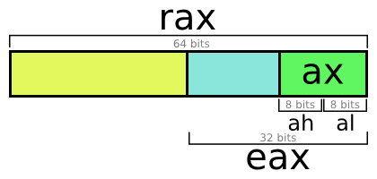
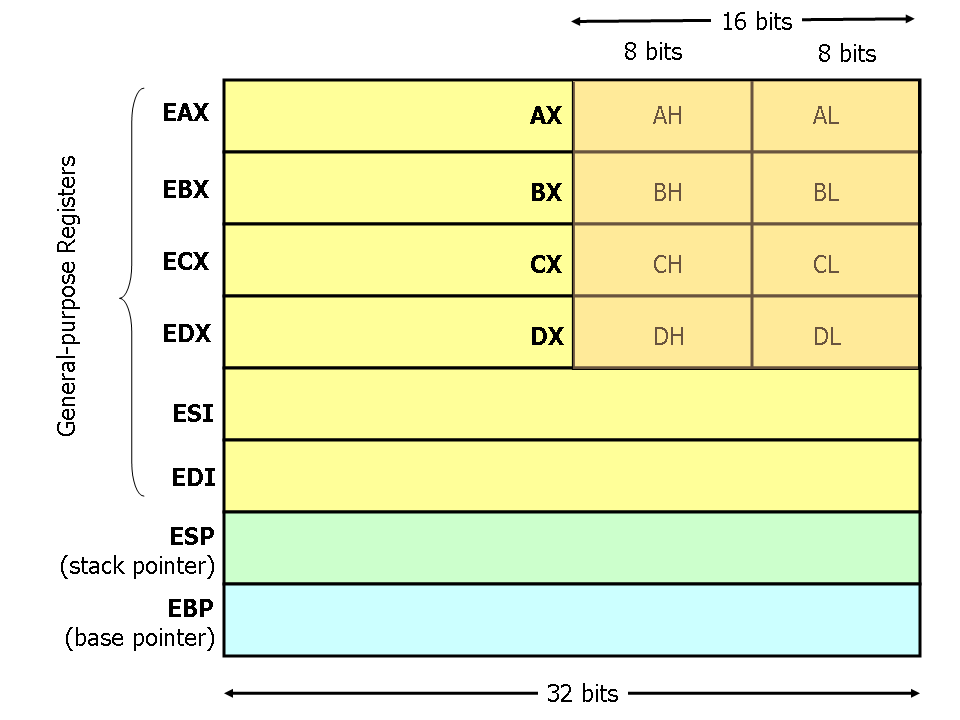
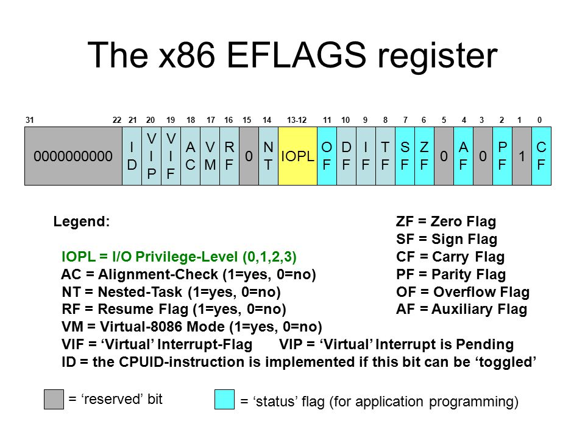
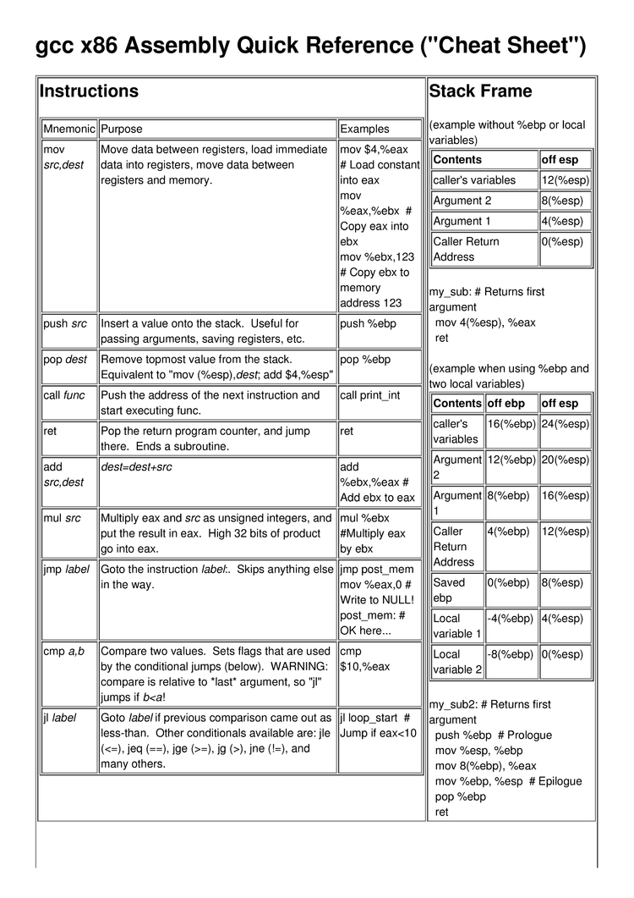

# 🛠 x86 Assembly Reverse Engineering 🛠
Knowledge I have found interesting about the topic of **x86 assembly**.

## ⚙️ Basics ⚙️

| Intel Type  | Bits | Name |
| ------------- | ------------- | ------------- |
| -  | 8 Bit  | **BYTE**  |
| 8086  | 16 Bit  | **WORD**  |
| i386  | 32 Bit  | **DWORD**  |
| x86  | 64 Bit  | **QWORD**  |

### Meanings:
dword = **DWORD** = (double-word)  
qword = **QWORD** = (quad-word)

### NOTE: 📝
On 32 Bit ARM CPUs a WORD is 32 Bit.

## 🔧 x86 Registers 🔧

*(Older Text from the University of Virginia Computer Science (2006), one of the best Guides for x86 Assembly)*

Modern (i.e 3**86** and beyond) x**86** processors have eight 32-bit general purpose registers, as depicted in Figure 1. **The register names are mostly historical**. For example, **EAX** used to be called the accumulator since it was used by a number of arithmetic operations, and **ECX** was known as the counter since it was used to hold a loop index. Whereas most of the registers have lost their special purposes in the modern instruction set, by convention, two are reserved for special purposes — **the stack pointer (ESP)** and the **base pointer (EBP).**

For the **EAX**, **EBX**, **ECX**, and **EDX** registers, subsections may be used. For example, the least significant 2 bytes of **EAX** can be treated as a 16-bit register called **AX**. The least significant byte of **AX** can be used as a single 8-bit register called **AL**, while the most significant byte of **AX** can be used as a single 8-bit register called **AH**. These names refer to the same physical register. When a two-byte quantity is placed into **DX**, the update affects the value of **DH**, **DL**, and **EDX**. These sub-registers are mainly hold-overs from older, 16-bit versions of the instruction set. However, they are sometimes convenient when dealing with data that are smaller than **32-bits (e.g. 1-byte ASCII characters)**.

When referring to registers in assembly language, **the names are not case-sensitive**. For example, the names **EAX** and **eax** refer to the **same register**.

 

In **x86 registers** have an '**e**' in front of their name. 
Example: **e**ax, **e**bx, **e**cx, **e**dx, **e**bp

*Additional Info:  
In **x64** you have a '**r**' instead. 
Example: **r**ax, **r**bx, **r**cx, **r**dx, **r**bp 
You also have **double-precision floating point going from xmm0 to xmm15**.*

### 🚩 EFLAGS 🚩

### [📝 Cheatsheet x86 Assembly 📝](Docs/x86_Assembly.pdf)

[Full Cheatsheet x86 Assembly, 20 Pages.](Docs/x86_Assembly.pdf)

 
  

